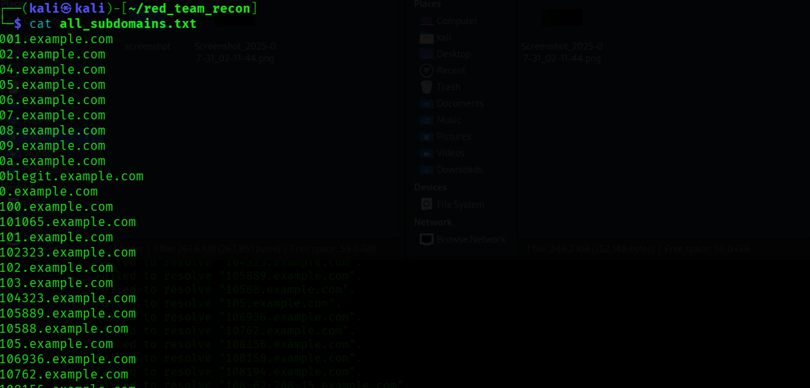
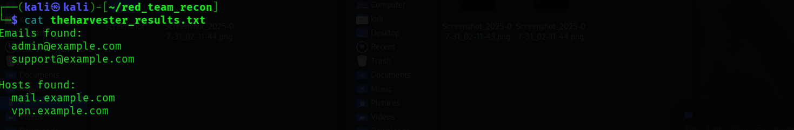
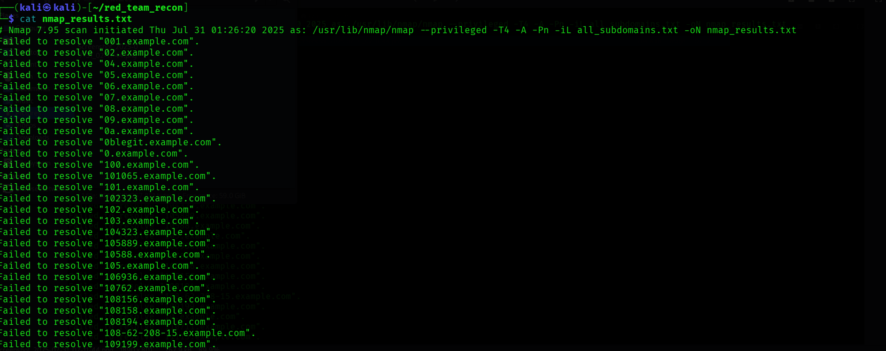
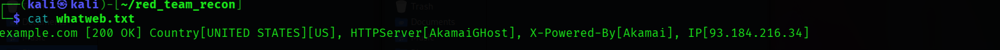
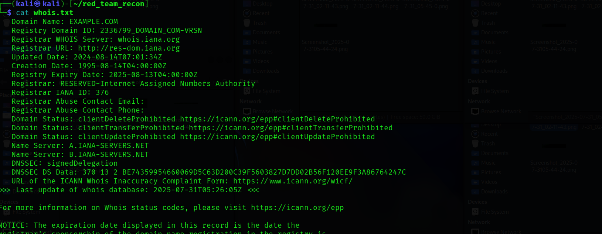

# 🛡️ Red Team Recon – Major Project

## 📌 Overview
**Red Team Recon** is an advanced cybersecurity project designed to simulate real-world reconnaissance as part of a penetration testing workflow.  
The goal is to identify publicly available information about a target, map its attack surface, and collect data for further security analysis — all within a **safe, fictional environment**.

> ⚠️ **Disclaimer:** This project is for **educational purposes only**.  
> The target domain (`example.com`) is a placeholder for safe testing.  
> Never run these tools against real systems without permission.

---

## 🚀 Features
- Automated **Subdomain Enumeration** using `Amass` and `Subfinder`
- **WHOIS Lookup** for domain registration details
- **Web Fingerprinting** using `WhatWeb`
- **Email Harvesting** with `theHarvester`
- **Port Scanning** via `Nmap`
- Organized results in `.txt` format and screenshots

---

## 🛠 Tools Used
| Tool | Purpose |
|------|---------|
| **Amass** | Passive & active subdomain enumeration |
| **Subfinder** | High-speed passive subdomain discovery |
| **Nmap** | Network scanning & service enumeration |
| **WhatWeb** | Website fingerprinting |
| **theHarvester** | Email and host information gathering |
| **WHOIS** | Domain registration details |

---

## 📂 Project Structure
red_team_recon/
│── all_subdomains.txt # Combined results from Amass & Subfinder
│── amass_subdomains.txt # Amass output
│── subfinder_subdomains.txt # Subfinder output
│── nmap_results.txt # Nmap scan results
│── whatweb.txt # Web fingerprinting details
│── theharvester_results.txt # Emails & hosts from theHarvester
│── whois.txt # WHOIS lookup details
│── images/ # Screenshots of execution & results
│── README.md # This documentation

---
📸 Screenshots












---
📜 License
This project is licensed under the MIT License – free to use for learning and research.

---
✍️ Author
Balaram Das
GitHub: balaramdas2004

---

## ⚙️ Installation

### 1️⃣ Clone the repository
```bash
git clone https://github.com/balaramdas2004/red-team-recon-major-project.git
cd red-team-recon-major-project

##2️ Install required tools
sudo apt update
sudo apt install amass subfinder nmap whatweb theharvester whois -y

##Run Amass
amass enum -passive -d example.com -o amass_subdomains.txt

##Run Subfinder
subfinder -d example.com -o subfinder_subdomains.txt

##Combine results
cat amass_subdomains.txt subfinder_subdomains.txt | sort -u > all_subdomains.txt

##Run WHOIS
whois example.com > whois.txt

##Web Fingerprinting
whatweb example.com > whatweb.txt

##Email & Host Harvesting
theHarvester -d example.com -b all > theharvester_results.txt

##Nmap Port Scan
nmap -iL all_subdomains.txt -oN nmap_results.txt


